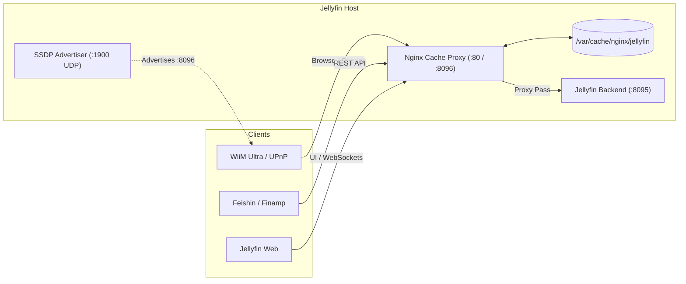

# Jellyfin Cache Proxy & Pre-warmer

High-performance Nginx caching reverse proxy and automated pre-warming suite specifically designed for **Jellyfin Media Server**, optimized for:
- **Massive Music Libraries & Playlists** (5,000+ tracks per playlist).
- **UPnP / DLNA Streamers** (WiiM Ultra, WiiM Pro, Yamaha MusicCast, Cambridge Audio, etc.).
- **Modern Music Clients** ([Feishin](https://github.com/jeffvli/feishin), [Finamp](https://github.com/jmshrv/finamp), Jellyfin Web).
- **Eliminating Cloudflare 524 Timeouts & UPnP Device Hangs**.

---

## 🎯 The Problems This Solves

### 1. The "Massive Playlist" Bottleneck
When requesting large playlists (e.g. 4,000–6,000 songs) in Jellyfin, the server must query the SQLite database, resolve linked tracks, format metadata, and serialize response payloads up to 10MB in size.
- **Without Cache**: Takes **30 to 180 seconds** per request.
- **Client Impact**:
  - **Cloudflare**: Drops connections after 100s with `HTTP 524 Gateway Timeout`.
  - **Feishin / Finamp**: Shows spinning wheel, infinite loaders, or crashes.
  - **Jellyfin Web**: Stalls for tens of seconds when browsing playlist views.
  - **UPnP / DLNA Streamers**: Network timeouts (`HTTP 504`), socket disconnections, or empty playlist views.
- **With Cache**: Cached responses are served in **under 10ms**, eliminating server load completely.

### 2. The DLNA / UPnP SOAP Caching Challenge
DLNA `ContentDirectory` browse requests use HTTP **`POST`** with XML/SOAP envelopes (`SOAPACTION: "urn:schemas-upnp-org:service:ContentDirectory:1#Browse"`).
- By default, HTTP caches (including standard Nginx setups) only cache `GET` and `HEAD` requests.
- Nginx here is uniquely configured to cache `POST` requests keyed by `SOAP|$uri|$http_soapaction|$request_body`.

### 3. Loopback & Host IP Poisoning in DLNA
In Jellyfin, DLNA DIDL-Lite metadata dynamically includes track `<res>` and `<upnp:albumArtURI>` URLs using the incoming HTTP `Host` header.
- If a background warmup script or localhost crawler queries `http://127.0.0.1`, Jellyfin generates URLs like `http://127.0.0.1/dlna/audio/.../stream.flac`.
- If saved to cache, external DLNA renderers (like a physical WiiM Ultra streamer) receive `127.0.0.1` and try to fetch streams and album art from **themselves**, causing playback failure and missing cover art.
- **Solution**: The Nginx configuration enforces the server's real LAN IP and port in `proxy_set_header Host "<SERVER_IP>:<PORT>"` and performs response body rewriting (`sub_filter`).

### 4. CORS Header Loss on Cached Responses
When Nginx serves a cached `200 OK` response directly from disk, Jellyfin's upstream CORS headers (`Access-Control-Allow-Origin`, etc.) are missing.
- Web apps and desktop clients (Feishin) reject the response due to browser CORS policies.
- **Solution**: Nginx strips upstream CORS headers and injects uniform CORS headers for all responses.

### 5. Missing Tracks in Playlists on Case-Insensitive Filesystems (exFAT / NTFS / SMB)
If your music library is mounted from an exFAT, NTFS, or SMB drive, filesystem path matching is case-insensitive on disk. However, Jellyfin's SQLite database performs **exact case-sensitive matching** against paths in its `BaseItems` table.
- When an M3U playlist contains track paths with casing discrepancies (e.g. `Lossless` vs `LOSSLESS`, `Various Artists` vs `Various artists`, `.flac` vs `.FLAC`), Jellyfin fails to match them:
  ```text
  [WRN] Unable to find linked item at path "/mnt/user/music/..."
  ```
- The song silently disappears from the playlist in Jellyfin and all connected players (WiiM, Feishin, Web).
- **Solution**: Use [`tools/fix-m3u-case.py`](tools/fix-m3u-case.py) to automatically synchronize M3U playlist file paths with the canonical database casing stored in Jellyfin's `jellyfin.db`.

---

## 📁 Repository Structure

```
.
├── nginx-jellyfin-cache.conf       # Nginx site configuration (REST & SOAP cache)
├── jellyfin-cache-prewarm.py       # Python script for DLNA, REST & Web UI pre-warming
├── jellyfin-proxy-ssdp.py          # Standalone SSDP advertiser for port 8096 proxy
├── tools/
│   └── fix-m3u-case.py             # Fixes playlist path casing against jellyfin.db
└── systemd/
    ├── jellyfin-cache-prewarm.service   # Systemd oneshot warmup service
    ├── jellyfin-cache-prewarm.timer     # Systemd timer (runs every 4 hours)
    └── jellyfin-proxy-ssdp.service      # Systemd service for SSDP advertiser
```

---

## 🚀 Architecture & Ports



- **Frontend Nginx**: Listens on `:80` and `:8096`.
- **Jellyfin Origin**: Rebound to `:8095` (localhost only).
- **Endpoints Cached**:
  - `/playlists/{id}/items` (Feishin)
  - `/users/{uid}/items/{id}` (Feishin metadata)
  - `/items?ParentId=...` (Finamp)
  - `/users/{uid}/items?ParentId=...` (Jellyfin Web & generic clients)
  - `/artists`, `/artists/albumartists`, `/musicgenres`
  - `/dlna/{id}/contentdirectory/control` (SOAP Browse)
  - `/jellyfin-proxy/description.xml` (Custom UPnP device description)

---

## 🛠️ Installation & Setup

### Prerequisites
- Nginx with `http_sub_module` (standard in Ubuntu/Debian: `apt install nginx`).
- Python 3.8+ (standard library only, no external pip dependencies).
- Jellyfin Media Server.

### Step 1: Reconfigure Jellyfin Port
Change Jellyfin's internal HTTP port from `8096` to `8095`:
In Jellyfin Dashboard -> **Networking** -> **Local HTTP port**: change `8096` to `8095`, or edit `/etc/jellyfin/network.xml`:
```xml
<LocalHttpPort>8095</LocalHttpPort>
```
Restart Jellyfin:
```bash
sudo systemctl restart jellyfin
```

### Step 2: Install Nginx Configuration
1. Copy the configuration file:
   ```bash
   sudo cp nginx-jellyfin-cache.conf /etc/nginx/sites-available/jellyfin-cache.conf
   ```
2. Edit `/etc/nginx/sites-available/jellyfin-cache.conf` and update your server's reachable LAN IP:
   ```nginx
   # Replace 192.168.2.251 with your server's LAN IP:
   proxy_set_header Host "192.168.2.251:8096";
   sub_filter "http://127.0.0.1/" "http://192.168.2.251:8096/";
   sub_filter "http://192.168.2.251/" "http://192.168.2.251:8096/";
   ```
3. Enable the site and create the cache directory:
   ```bash
   sudo mkdir -p /var/cache/nginx/jellyfin
   sudo chown -R www-data:www-data /var/cache/nginx/jellyfin
   sudo ln -sf /etc/nginx/sites-available/jellyfin-cache.conf /etc/nginx/sites-enabled/
   sudo nginx -t && sudo systemctl reload nginx
   ```

### Step 3: Install & Configure the Pre-warm Script
The pre-warm script iterates over:
1. **DLNA Root** (`ObjectID: 0`) and **Playlists folder**.
2. **DLNA pagination chunks** (`RequestedCount: 10, 100, 500`) to guarantee that mobile UPnP apps (like WiiM Home) immediately hit the cache when opening playlists.
3. **REST API Playlists & Folders** for all users:
   - Playlists folder view & metadata (`/Users/{uid}/Items?ParentId={playlists_folder_id}&StartIndex=0&Limit=100...` used by Web and Smart TVs like LG webOS)
   - Feishin items & metadata endpoints
   - Finamp items endpoint
   - Jellyfin Web client items endpoint (`/Users/{uid}/Items?ParentId=...&Limit=300`)

1. Copy the script to `/usr/local/bin`:
   ```bash
   sudo cp jellyfin-cache-prewarm.py /usr/local/bin/jellyfin-cache-prewarm.py
   sudo chmod +x /usr/local/bin/jellyfin-cache-prewarm.py
   ```
2. Generate an API Key in Jellyfin:
   - Dashboard -> **Administration** -> **API Keys** -> Create new key (e.g. `CachePrewarm`).
3. Set your configuration inside `/usr/local/bin/jellyfin-cache-prewarm.py` or via environment variables (`JELLYFIN_API_TOKEN`):
   ```python
   API_TOKEN = "your_jellyfin_api_key_here"
   ```
4. Test run the script manually:
   ```bash
   sudo /usr/local/bin/jellyfin-cache-prewarm.py
   ```

### Step 4: Setup Systemd Timer (Automated Warmup)
To keep the cache continuously fresh without manual intervention:

1. Copy systemd units:
   ```bash
   sudo cp systemd/jellyfin-cache-prewarm.service /etc/systemd/system/
   sudo cp systemd/jellyfin-cache-prewarm.timer /etc/systemd/system/
   ```
2. Reload and enable the timer:
   ```bash
   sudo systemctl daemon-reload
   sudo systemctl enable --now jellyfin-cache-prewarm.timer
   ```
3. Verify status:
   ```bash
   systemctl list-timers | grep jellyfin
   ```

### Step 5: (Optional) Fixing Playlist Case-Sensitivity Mismatches
If songs are missing from your M3U playlists in Jellyfin due to exFAT/Samba case differences:
```bash
python3 tools/fix-m3u-case.py /path/to/playlist.m3u /var/lib/jellyfin/data/jellyfin.db
```
The script will match each track path case-insensitively against Jellyfin's database, create a backup copy (`.casefix_bak`), and rewrite the playlist with the exact canonical casing.

---

## 📊 Monitoring & Cache Statistics

Check real-time cache hits and misses:
```bash
tail -f /var/log/nginx/cache.log
```
Sample output:
```
2026-09-18T16:24:41 client=192.168.2.96 cache=HIT status=200 rt=0.001 "/dlna/.../control" action="urn:schemas-upnp-org:service:ContentDirectory:1#Browse"
2026-09-18T16:24:42 client=192.168.2.250 cache=HIT status=200 rt=0.012 "/playlists/.../items" action="-"
```

To purge the cache completely:
```bash
sudo rm -rf /var/cache/nginx/jellyfin/* && sudo systemctl reload nginx
```

---

## 📄 License
MIT License. Feel free to use and contribute!
